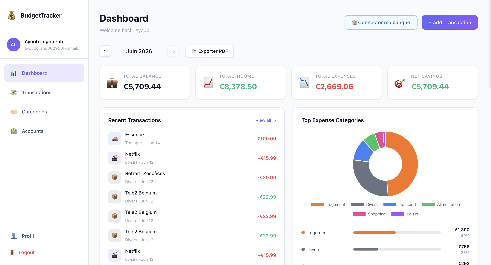
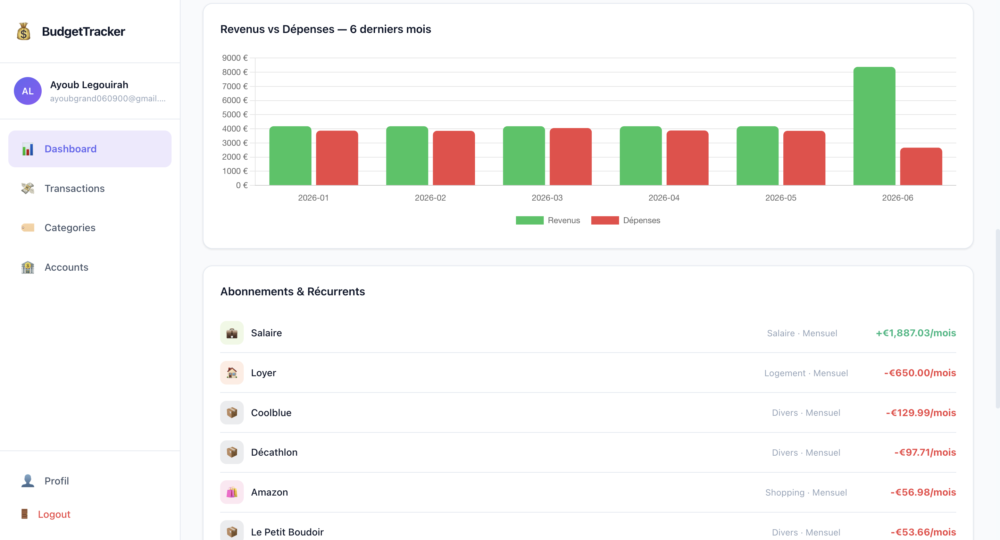
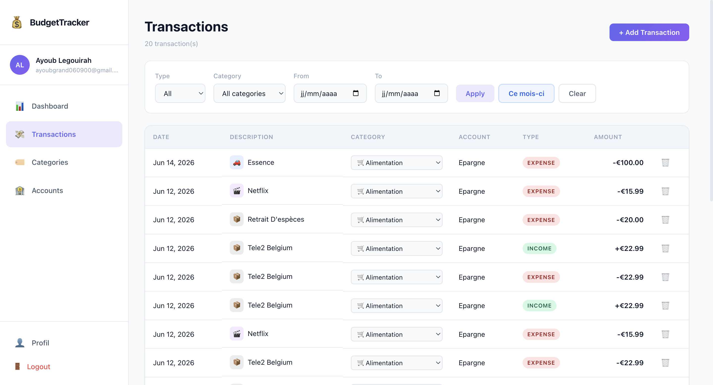
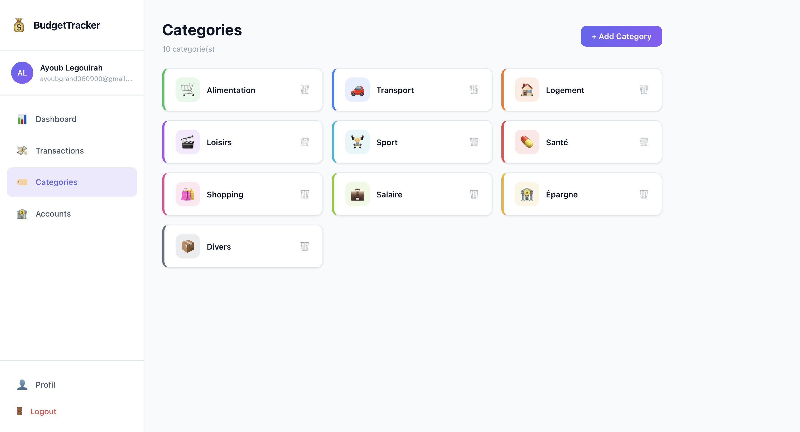
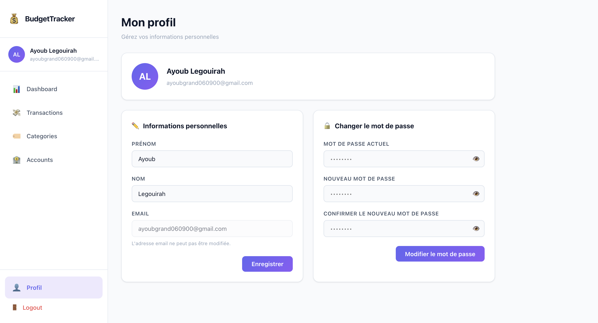

# 💰 Budget Tracker UI

> Angular 22 frontend for a personal budget management app — interactive dashboards, transaction tracking, smart filters, PDF export, and open banking via Tink.


---

## Table of Contents

- [Features](#features)
- [Tech Stack](#tech-stack)
- [Architecture](#architecture)
- [Getting Started](#getting-started)
- [Screenshots](#screenshots)
- [Backend](#backend)

---

## Features

### 📊 Dashboard

- **Month selector** — navigate across months with `←` / `→` arrows; all stats update to the selected month
- **4 summary cards** — balance, income, expenses, net savings (from `GET /api/stats/balance?month=YYYY-MM`)
- **Expense pie chart** — doughnut chart with custom category colours + progress bar list showing amount and percentage per category (from `GET /api/stats/by-category?month=YYYY-MM`)
- **Monthly bar chart** — grouped income vs expenses over the last 6 months (from `GET /api/stats/monthly`), always fixed regardless of the month selector
- **Recurring subscriptions** — auto-detected recurring transactions (Netflix, rent, salary…) with category icon, frequency badge, monthly amount in green (income) or red (expense), and a monthly total (from `GET /api/transactions/recurring`)
- **PDF export** — one-click monthly report for the selected month; triggers `GET /api/reports/monthly?month=YYYY-MM` and downloads `bilan-YYYY-MM.pdf` with a spinner during generation
- **Recent transactions** — last 10 transactions with category icon and amount
- **Accounts overview** — summary of all bank accounts

### 💸 Transactions

- **Paginated table** — 25 transactions per page with smart pagination (`1 … 4 5 [6] 7 8 … 248`)
- **Combined server-side filters** — type (Income / Expense / All), category, date range From/To
- **"This month" shortcut** — pre-fills From/To with the current calendar month
- **Inline category edit** — dropdown per row, calls `PATCH /api/transactions/{id}/category` without a full reload
- **Create transaction** — modal form with account, category, type, amount, date, note
- **Delete** with confirmation dialog

### 🏷️ Categories

- Full CRUD with custom emoji icon and hex colour picker
- Categories are shared across transactions, budgets, and stats

### 🏦 Accounts

- Manage bank accounts (name, currency, balance)

### 🏦 Open Banking — Tink

- Open banking integration via Tink Link
- Automatic transaction import from your bank
- Return callback with success/error banner and imported count

### 👤 Profile

- Display user info (from `GET /api/users/me`)
- Edit first name and last name — sidebar avatar updates instantly
- Change password (current + new + confirm)
- Auto-dismissing success / error messages

---

## Tech Stack

| Layer | Technology |
|---|---|
| Framework | [Angular 22](https://angular.dev) — standalone components, zoneless |
| Language | TypeScript 6.0 |
| State | Angular Signals (`signal`, `computed`) |
| Charts | [Chart.js 4.5](https://www.chartjs.org) — native, no wrapper |
| Styles | Plain CSS (CSS variables, no UI framework) |
| HTTP | `HttpClient` with automatic JWT interceptor |
| Routing | Angular Router — lazy-loaded pages |
| Auth | JWT stored in localStorage, guard on all protected routes |

---

## Architecture

```
src/app/
├── core/
│   ├── guards/
│   │   └── auth.guard.ts             # Redirects to /login if unauthenticated
│   ├── interceptors/
│   │   └── jwt.interceptor.ts        # Injects Bearer token on every request
│   ├── models/
│   │   ├── user.model.ts
│   │   ├── transaction.model.ts      # Transaction, RecurringTransaction, PagedResponse
│   │   ├── category.model.ts
│   │   ├── account.model.ts
│   │   ├── stats.model.ts            # BalanceStat, CategoryStat, MonthlyStat
│   │   └── budget.model.ts           # Budget, BudgetSummary, CreateBudgetRequest
│   └── services/
│       ├── auth.service.ts           # Login, register, logout, currentUser signal
│       ├── user.service.ts           # GET/PUT /api/users/me
│       ├── transaction.service.ts    # CRUD + loadFiltered + patchCategory + getRecurring
│       ├── category.service.ts       # CRUD categories
│       ├── account.service.ts        # CRUD accounts
│       ├── stats.service.ts          # balance, by-category, monthly (month param)
│       ├── budget.service.ts         # CRUD budgets + getSummary(month)
│       ├── report.service.ts         # downloadMonthlyReport(month) → Blob
│       └── tink.service.ts           # Tink connect URL
│
├── layout/
│   └── layout.component.ts          # Shell: sidebar + <router-outlet>
│
├── shared/
│   ├── sidebar/
│   │   └── sidebar.component.*      # Nav links + profile + logout
│   └── charts/
│       ├── pie-chart.component.ts   # Doughnut — Chart.js
│       └── bar-chart.component.ts   # Grouped bars — Chart.js
│
└── pages/
    ├── auth/
    │   ├── login/
    │   └── register/
    ├── dashboard/                   # Stats + charts + recurring + PDF export
    ├── transactions/                # Filtered, paginated table + inline edits
    ├── categories/
    ├── accounts/
    ├── budgets/                     # Monthly budget limits with progress bars
    ├── profile/                     # Personal info + password change
    └── tink/
        └── tink-callback.component.ts
```

### Data flow (Signals)

```
Service (private signal) ──► component.readonly signal ──► template (reactive)
          ▲
     HTTP + tap()
```

Each service exposes a readonly signal. Components never mutate state directly — they call service methods that update the signal via `tap()`. Derived values use `computed()`.

---

## Getting Started

### Prerequisites

- Node.js 20+
- npm 10+
- [Budget Tracker API](https://github.com/your-username/budget-tracker-api) running on `http://localhost:8080`

### Install

```bash
git clone https://github.com/your-username/budget-tracker-ui.git
cd budget-tracker-ui
npm install
```

### Development server

```bash
ng serve
# → http://localhost:4200
```

### Production build

```bash
ng build
# Output in dist/budget-tracker-ui/
```

---

## Screenshots

### Dashboard — Stats & Charts



### Dashboard — Recurring Subscriptions



### Transactions



### Categories



### Profile



---

## Backend

This frontend consumes the Spring Boot 4 REST API:

**→ [budget-tracker-api](https://github.com/your-username/budget-tracker-api)**

The API runs on `http://localhost:8080` by default. To change the base URL, replace `http://localhost:8080` in every service file under `core/services/`.

### API Endpoints

| Method | Endpoint | Description |
|---|---|---|
| `POST` | `/api/auth/login` | Authenticate |
| `POST` | `/api/auth/register` | Register |
| `GET` | `/api/users/me` | Get current user |
| `PUT` | `/api/users/me` | Update name |
| `PUT` | `/api/users/me/password` | Change password |
| `GET` | `/api/transactions` | List transactions (paginated, filterable) |
| `POST` | `/api/transactions` | Create transaction |
| `PATCH` | `/api/transactions/{id}/category` | Update category inline |
| `DELETE` | `/api/transactions/{id}` | Delete transaction |
| `GET` | `/api/transactions/recurring` | Detect recurring transactions |
| `GET` | `/api/stats/balance` | Monthly balance summary (`?month=YYYY-MM`) |
| `GET` | `/api/stats/by-category` | Expenses by category (`?month=YYYY-MM`) |
| `GET` | `/api/stats/monthly` | 6-month income vs expenses history |
| `GET` | `/api/budgets` | List budgets |
| `POST` | `/api/budgets` | Create budget |
| `DELETE` | `/api/budgets/{id}` | Delete budget |
| `GET` | `/api/budgets/summary` | Budget progress (`?month=YYYY-MM`) |
| `GET` | `/api/reports/monthly` | Generate PDF report (`?month=YYYY-MM`) |
| `GET` | `/api/categories` | List categories |
| `POST` | `/api/categories` | Create category |
| `DELETE` | `/api/categories/{id}` | Delete category |
| `GET` | `/api/accounts` | List accounts |
| `GET` | `/api/tink/connect-url` | Tink Link connect URL |

---

## License

MIT
